==============================
Running the full CADRE problem
==============================

The previous tutorials provided short practical introductions to some of the
OpenMDAO components which are used in the CADRE problem. To run the full
CADRE problem:

    - Obtain a license and source code for `SNOPT <http://www.sbsi-sol-optimize.com/asp/sol_product_snopt.htm>`_
    - Build and install `PyOpt <http://www.pyopt.org/>`_ with SNOPT support
    - Install `pyopt_driver <https://github.com/OpenMDAO-Plugins/pyopt_driver>`_ for OpenMDAO

The CADRE optimization problem can then by run by importing and running the
`CADRE_Optimization` assembly:

.. code-block:: python

    from openmdao.lib.casehandlers.api import CSVCaseRecorder
    from CADRE import CADRE_Optimization

    print "setting up"
    top = CADRE_Optimization(n=1500, m=300)
    top.driver.recorders = [CSVCaseRecorder(filename='CADRE.csv')]
    printvars = []
    for var in ['Data', 'ConCh', 'ConDs', 'ConS0', 'ConS1', 'SOC']:
        printvars += ["pt" + str(i) + ".Data" for i in xrange(6)]
    top.driver.printvars = printvars
    print "running"
    top.run()

This is implemented in `example.py`, in the top-level directory of the CADRE
plugin repository.
The purpose of the CSV case recorder is to save the state of the optimization
after each iteration of the assembly's driver. These iteration states will be
saved as lines in the file `CADRE.csv`. You can read from this file and
examine the performance of the optimization after the optimization has completed,
or even while the optimization is still occurring.

An example of how this file may be inspected:

.. code-block:: python

    import csv
    import numpy as np
    import pylab

    f = open("CADRE.csv", "rb")
    reader = csv.DictReader(f, skipinitialspace=True)

    X, Y, Z = [], [], []

    pcom = []

    for row in reader:
        data = [row["pt" + str(i) + ".Data[0][1499]"] for i in xrange(6)]
        sumdata = sum([float(i) for i in data if i])
        c1 = [row["Constraint ( pt" + str(i) + ".ConCh<=0 )"] for i in xrange(6)]
        c2 = [row["Constraint ( pt" + str(i) + ".ConDs<=0 )"] for i in xrange(6)]
        c3 = [row["Constraint ( pt" + str(i) + ".ConS0<=0 )"] for i in xrange(6)]
        c4 = [row["Constraint ( pt" + str(i) + ".ConS1<=0 )"] for i in xrange(6)]
        c5 = [row["Constraint ( pt" + str(i) + ".SOC[0][0]=pt" + str(i) + ".SOC[0][-1] )"]
              for i in xrange(6)]
        # c1_f = np.all([float(i) < 0 for i in c1 if i])
        # c2_f = np.all([float(i) < 0 for i in c2 if i])
        # c3_f = np.all([float(i) < 0 for i in c3 if i])
        # c4_f = np.all([float(i) < 0 for i in c4 if i])
        # c5_f = np.all([float(i) < 0 for i in c4 if i])

        c1_f = sum([float(i) for i in c1 if i])
        c2_f = sum([float(i) for i in c2 if i])
        c3_f = sum([float(i) for i in c3 if i])
        c4_f = sum([float(i) for i in c4 if i])
        c5_f = sum([float(i) for i in c5 if i])

        feasible = [c1_f, c2_f,  c3_f, c4_f, c5_f]

        X.append(sumdata), Y.append(sum(feasible)), Z.append(feasible)

        print sumdata

    Z = np.array(Z)
    if not len(Z):
        print "no data yet..."
        quit()
    pylab.figure()
    pylab.subplot(311)
    pylab.title("total data")
    pylab.plot(X, 'b')
    pylab.plot([0, len(X)], [3e4, 3e4], 'k--', marker="o")
    pylab.subplot(312)
    pylab.title("Sum of Constraints")
    pylab.plot([0, len(Y)], [0, 0], 'k--', marker="o")
    pylab.plot(Y, 'k')
    pylab.subplot(313)
    pylab.title("Max of Constraints")
    pylab.plot([0, len(Z)], [0, 0], 'k--')
    pylab.plot(Z[:, 0], marker="o", label="c1")
    pylab.plot(Z[:, 1], marker="o", label="c2")
    pylab.plot(Z[:, 2], marker="o", label="c3")
    pylab.plot(Z[:, 3], marker="o", label="c4")
    pylab.plot(Z[:, 4], marker="o", label="c5")
    pylab.legend(loc="best")
    pylab.show()

This is implemented in `readcsv.py`, in the top-level directory of the CADRE
plugin repository. When run, this will print the total data downloaded for each mdp at each iteration of
the optimization. This code produces a figure like the following:

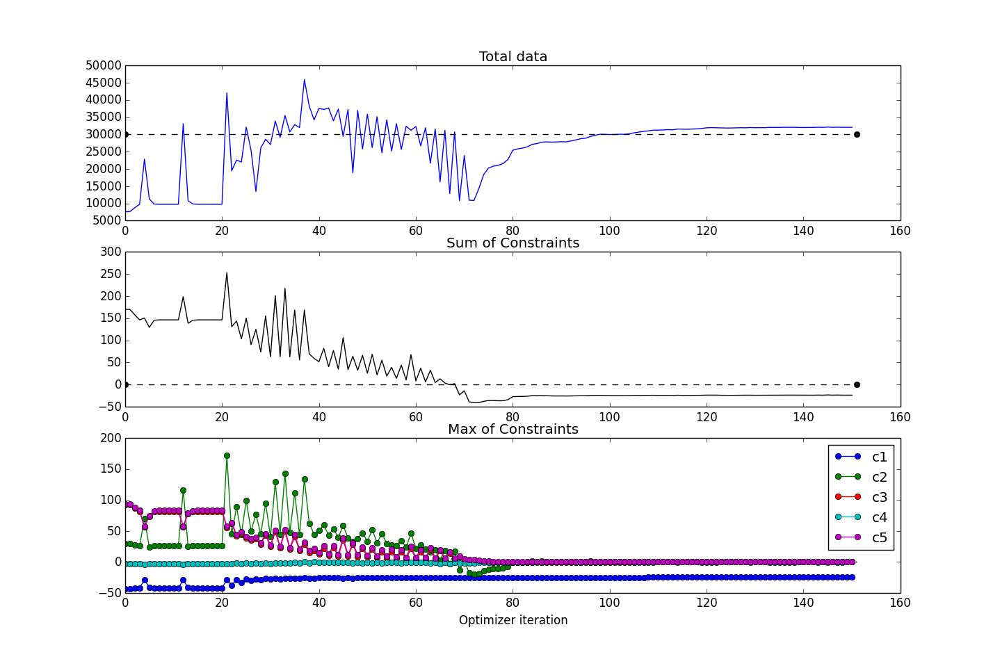

This figure shows several values plotted over the course of the optimization iterations. For this run, the CADRE problem converged in about 150 iterations (6 hours or so of runtime on a Macbook Pro 2.3GHz i7).
The top subplot shows the objective function value (total data downloaded), the middle subplot shows the maximum value of all constraints (values are all less than or equal to 0 for feasibility), and the bottom subplot shows
the maximum constraint values (across the 6 design points), broken down according to the 5 constraint types.

During the course of the optimization, the SNOPT optimizer will produce a
basis file, `fort.10`. In the event of a premature termination of the optimization,
SNOPT will automatically try to restart from the state determined by this file
the next time that the optimization is run in the same directory. If you would
rather cold-start the problem, this file can simply be deleted prior to
initializing an optimization if it exists.

We can easily rerun the problem with different configurations, such as a change in placement of the ground station, different lengths of time for the design points, etc. For example, if we wanted to re-optimize the entire problem but with McMurdo Station, Antarctica as the ground station, we could run:

.. code-block:: python

    from openmdao.lib.casehandlers.api import CSVCaseRecorder
    from CADRE import CADRE_Optimization

    print "setting up"
    top = CADRE_Optimization(n=1500, m=300)

    # reset ground station for each CADRE design point
    for i in xrange(6):
        pt = top.get("pt%s" % str(i))
        pt.lat = -77.85 # McMurdo latitude
        pt.lon = 166.666667 # longitude
        pt.alt = 2.835 # Altitude

    top.driver.recorders = [CSVCaseRecorder(filename='CADRE.csv')]
    printvars = []
    for var in ['Data', 'ConCh', 'ConDs', 'ConS0', 'ConS1', 'SOC']:
        printvars += ["pt" + str(i) + ".Data" for i in xrange(6)]
    top.driver.printvars = printvars
    print "running"
    top.run()

This will generate a CADRE.csv file, just as before.

============================================================
Interactive visualization of results
============================================================

Once an optimization of CADRE has successfully completed, you can run `generate_maps.py` in the top-level directory of the CADRE
plugin repository to generate some graphical summaries of the optimized design.

This will render a plot of several
optimized parameters over time period covered by that design point: The data download rate,
the power to the communications system, the roll angle, and the battery state-of-charge.

This script will also generate a Google Maps document (html file) that has the trajectories
of the CADRE satellite plotted for the selected design point. These trajectory lines
are colored based on the data download rate of the satellite at that period of time.

Note that the loading of the maps documents does require an Internet connection.

Examples of these plots and maps are shown interactively below. You can click on the radio buttons to select between two separate optimizations: one with Ann Arbor, MI as the ground station (default), or one with McMurdo Station as the ground station. You can also select to view data for each of the 6 CADRE design points individually.

Clicking the "Earth" button in the maps view will render the results using
Google Earth (which requires the Google Earth plugin for your browser).

These two plots can be compared directly: peaks in the download rate indicated in
the data figure should correspond to a pass of the satellite's orbit near to
the selected ground station.

.. raw:: html

    
    

    <table style="width: auto; margin: auto;"><tr><td style="width: auto; margin: auto;">

    Ground station:

    <input type="radio" name="gs" id="gs0" value="0" onclick="gs_change(0);" checked="checked" />Ann Arbor, MI, USA 
    <input type="radio" name="gs" id="gs1" value="1" onclick="gs_change(1);" />McMurdo Station, Antarctica 

    Design point:

    <input type="radio" name="pt" id="bt0" value="0" onclick="to(0);" checked="checked" />1 month after launch 
    <input type="radio" name="pt" id="bt1" value="1" onclick="to(1);" />3 months after launch 
    <input type="radio" name="pt" id="bt2" value="2" onclick="to(2);" />5 months after launch 
    <input type="radio" name="pt" id="bt3" value="3" onclick="to(3);" />7 months after launch 
    <input type="radio" name="pt" id="bt4" value="4" onclick="to(4);" />9 months after launch 
    <input type="radio" name="pt" id="bt5" value="5" onclick="to(5);" />11 months after launch 
    <input type="radio" name="pt" id="bt6" value="6" onclick="to('all');" />All design points (map only) 

     Total Data Downloaded:  
<h3>
    30820
     Gb</b></h3>

    </td><td style="width: auto; margin: auto;">
        

</td></tr></table>
        

      <iframe width="1000" height="500" id="map" src="_downloads/0_0_data.html" frameborder="0" allowfullscreen></iframe>

    

Fullscreen map views:

- :download:`Ann Arbor, design point 1 <maps/0_0_data.html>`
- :download:`Ann Arbor, design point 2 <maps/0_1_data.html>`
- :download:`Ann Arbor, design point 3 <maps/0_2_data.html>`
- :download:`Ann Arbor, design point 4 <maps/0_3_data.html>`
- :download:`Ann Arbor, design point 5 <maps/0_4_data.html>`
- :download:`Ann Arbor, design point 6 <maps/0_5_data.html>`
- :download:`Ann Arbor, all design points <maps/0_all_data.html>`

- :download:`McMurdo Station, design point 1 <maps/1_0_data.html>`
- :download:`McMurdo Station, design point 2 <maps/1_1_data.html>`
- :download:`McMurdo Station, design point 3 <maps/1_2_data.html>`
- :download:`McMurdo Station, design point 4 <maps/1_3_data.html>`
- :download:`McMurdo Station, design point 5 <maps/1_4_data.html>`
- :download:`McMurdo Station, design point 6 <maps/1_5_data.html>`
- :download:`McMurdo Station, all design points <maps/1_all_data.html>`

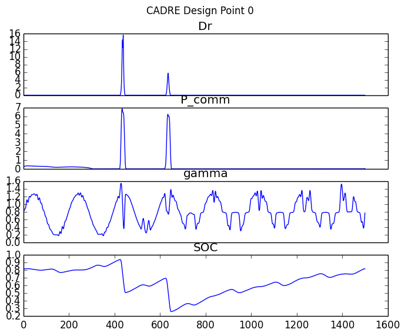

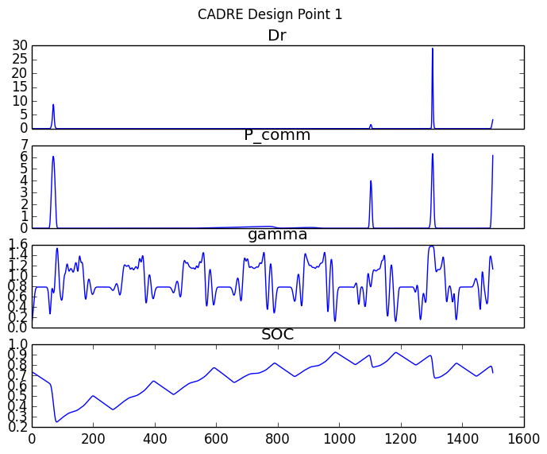

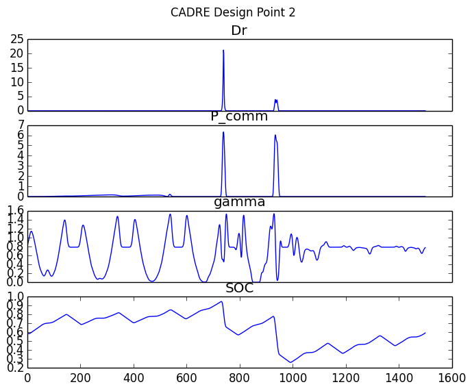

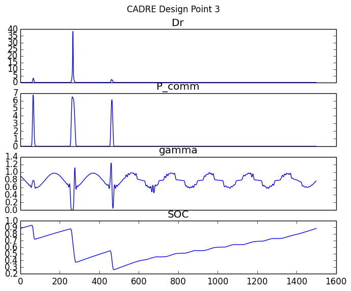

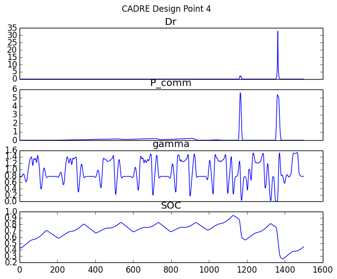

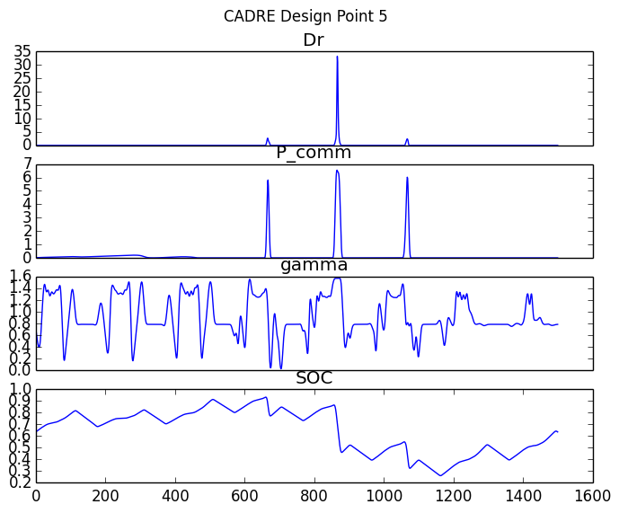

.. image:: maps/0_all.png
    :width: 0 px

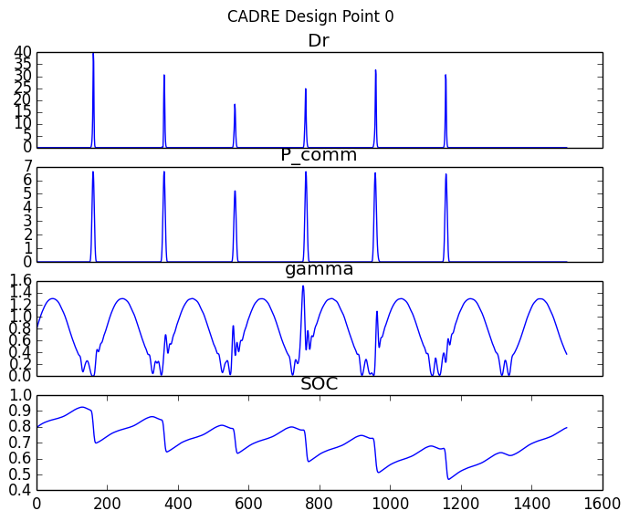

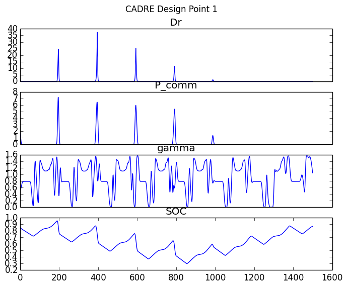

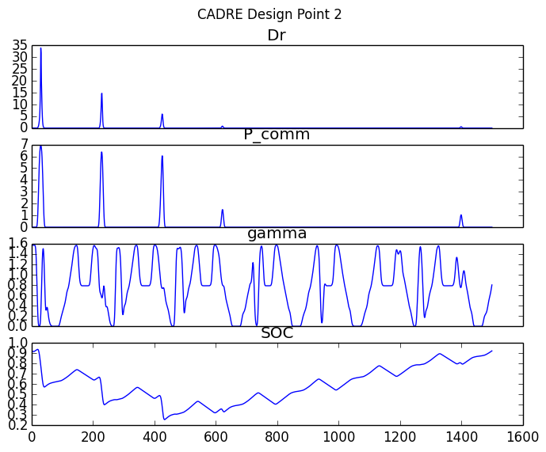

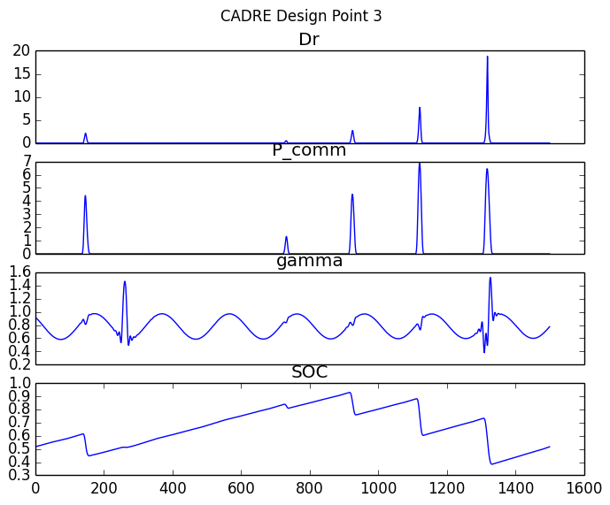

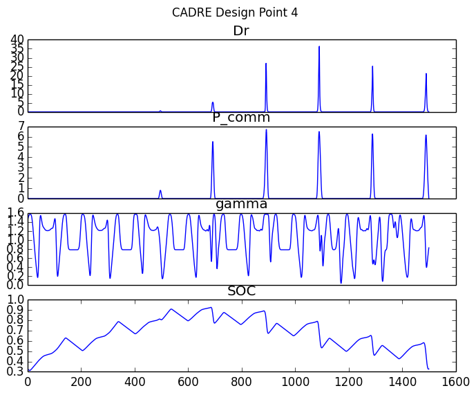

.. image:: maps/1_5.png
    :width: 0 px

