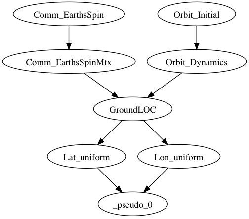
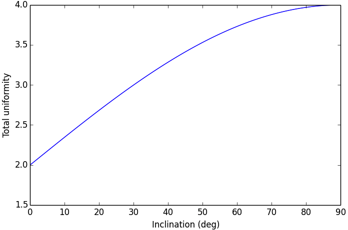

===========
Example: Optimization of the CADRE orbital parameters
===========

In this example, we will formulate a small-scale Assembly that will simply optimize the parameters of the CADRE satellite's orbit for the scientific utility of the mission alone. This will demonstrate how to import individual components of the CADRE problem to construct new assemblies, along with some basic usage of OpenMDAO's derivative system.

Specifically, we will optimize the values of orbital altitude, `right ascension node (RAAN) <https://en.wikipedia.org/wiki/Longitude_of_the_ascending_node>`_, `inclination <https://en.wikipedia.org/wiki/Orbital_inclination>`_, and `argument of perigee (arg. perigee) <https://en.wikipedia.org/wiki/Argument_of_periapsis>`_.
The objective of this optimization will be to produce an orbit that passes over the widest range of ground locations over the course of a fixed period of time from launch (3 days).

It's expected that this is achieved by a polar orbit, so that the dominant parameter of the problem is the orbital inclination. But strictly as an example, we can construct an assembly of components from CADRE and use an optimizer to illustrate this for us.

Several CADRE components will be imported and used to build this problem:

- The **Orbit_Initial()** component computes the initial position and velocity of the satellite based on apogee, perigee, RAAN, inclination, arg. perigee and true anomaly. So all design parameters are inputs to this component.

- The **Orbit_Dynamics()** takes that initial position and velocity and computed the position and velocity over a specified course of time.

- **Comm_EarthSpin()** computes a quaternion that models the rotation of the earth over a course of time. This is then computed into rotation matrices by the **Comm_EarthSpnMtx()** component.

We will then define two additional components to include in this model:

- **GroundLOC()** will take the earth spin rotation matrices over time (from **Comm_EarthSpinMtx()**) along with the satellite position vector over time (from **Orbit_Dynamics()**), and compute the corresponding ground locations beneath the satellite over time (in latitude and longitude).

- **Uniformity()** will take an array of latitude or longitude values, and compute the maximum minus the minimum value. This will give a rough measure of how "spread out" the values are. We will use two of these components: one for latitude and one for longitude. Our objective function will be the negative of the sum of these two components, which we will define directly as an expression.

Using these components, we will produce an OpenMDAO assembly with the following structure:

Here the component **_pseudo_0()** is the OpenMDAO pseudo-component that will be automatically constructed to compute our objective function expression.

To begin, in a new python file, we first import the libraries that we will use, which includes (among other things) the needed CADRE components, the standard OpenMDAO Component and Assembly classes, and the SLSQP optimization driver.

.. code-block:: python

    import numpy as np
    from openmdao.main.api import Assembly, Component
    from openmdao.lib.drivers.api import SLSQPdriver
    from openmdao.main.datatypes.api import Float, Array, Int

    from CADRE import Comm_EarthsSpin, Comm_EarthsSpinMtx
    from CADRE import Orbit_Initial, Orbit_Dynamics

Now we define the assembly. We add in the components and variables needed, the selected optimization driver, make connections between components, and configure the parameters of the optimization problem:

.. code-block:: python

    class CADRE_Launch(Assembly):

        """ Allows for analysis of the launch parameters of CADRE.

            Considers multiple launch parameters and their effects on
            coverage of the Earth's thermosphere.

            Ultimately, a launch that provides the most uniform sampling is
            favorable, which is expected to be given by a polar orbit
            (Inclination near 90). Other launch parameters are probably not
            very useful in comparison.
        """

        def __init__(self, n=200):

            super(CADRE_Launch, self).__init__()

            # Analysis parameters
            self.n = n
            self.add('t', Array(np.zeros((n,)), size=(n,),
                                dtype=np.float, iotype="in"))
            self.add('t1', Float(0., iotype='in'))
            self.add('t2', Float(259200., iotype='in'))
            h = (self.t2 - self.t1) / (self.n - 1)
            self.add("h", Float(h, iotype="in", copy=None))

            self.t = np.array(range(0, n)) * h

            self.add('driver', SLSQPdriver())

            # Orbit components
            self.add("Orbit_Initial", Orbit_Initial())
            self.driver.workflow.add("Orbit_Initial")
            self.Orbit_Initial.Inc = 0.1

            self.add("Orbit_Dynamics", Orbit_Dynamics(n))
            self.Orbit_Dynamics.force_fd = True
            self.driver.workflow.add("Orbit_Dynamics")

            self.add("Comm_EarthsSpin", Comm_EarthsSpin(n))
            self.driver.workflow.add("Comm_EarthsSpin")

            self.add("Comm_EarthsSpinMtx", Comm_EarthsSpinMtx(n))
            self.driver.workflow.add("Comm_EarthsSpinMtx")

            self.add("GroundLOC", GroundLOC(n))
            self.driver.workflow.add("GroundLOC")

            self.add("Lon_uniform", Uniformity(n))
            self.driver.workflow.add("Lon_uniform")

            self.add("Lat_uniform", Uniformity(n))
            self.driver.workflow.add("Lat_uniform")

            self.connect("t", "Comm_EarthsSpin.t")
            self.connect("h", "Orbit_Dynamics.h")
            self.connect("Comm_EarthsSpin.q_E", "Comm_EarthsSpinMtx.q_E")
            self.connect("Comm_EarthsSpinMtx.O_IE", "GroundLOC.O_IE")

            self.connect("Orbit_Initial.r_e2b_I0", "Orbit_Dynamics.r_e2b_I0")
            self.connect("Orbit_Dynamics.r_e2b_I", "GroundLOC.r_e2b_I")

            self.connect("GroundLOC.lats", "Lat_uniform.sample")
            self.connect("GroundLOC.lons", "Lon_uniform.sample")

            self.driver.add_objective("-Lat_uniform.k -Lon_uniform.k")
            self.driver.add_parameter(
                ["Orbit_Initial.altPerigee", "Orbit_Initial.altApogee"],
                low=500, high=1000)
            self.driver.add_parameter(
                "Orbit_Initial.RAAN", low=-180, high=180)
            self.driver.add_parameter(
                "Orbit_Initial.Inc", low=0, high=90)
            self.driver.add_parameter(
                "Orbit_Initial.argPerigee", low=0, high=90)

Note that the orbital altitude was specified as an optimization parameter by setting both the perigee and apogee values together as a single input. This indicates to the optimization driver that we want to vary these two values together, which is sufficient for constraining the optimization to circular orbits of a set altitude.

The **GroundLOC()** component is implemented next, with derivatives defined using the linearize, apply_deriv, and apply_derivT methods. In this case,
the derivative expressions were determined using a computer algebra system:

.. code-block:: python

    class GroundLOC(Component):

        """ Gives the lat and lon location of the ground beneath a satellite
        """
        Re = 6378.137
        r2d = 180 / np.pi

        def __init__(self, n):
            super(GroundLOC, self).__init__()
            self.n = n
            self.add('O_IE', Array(np.zeros((3, 3, self.n)), iotype='in'))

            self.add('r_e2b_I', Array(np.zeros((6, self.n)), iotype='in'))

            self.add('lats', Array(np.zeros(self.n), iotype='out'))
            self.add('lons', Array(np.zeros(self.n), iotype='out'))

        def linearize(self):
            self.J = np.zeros((self.n, 2, 3))
            self.J_O_IE = np.zeros((self.n, 2, 3, 3))

            for i in xrange(self.n):

                O = self.O_IE[:, :, i].T
                r = self.r_e2b_I[:3, i]
                d = self.r2d

                self.J[i, 0, 0] = self.d_lat(
                    O[2, 0], O[2, 1], O[2, 2], d, r[0], r[1], r[2])
                self.J[i, 0, 1] = self.d_lat(
                    O[2, 1], O[2, 0], O[2, 2], d, r[1], r[0], r[2])
                self.J[i, 0, 2] = self.d_lat(
                    O[2, 2], O[2, 1], O[2, 0], d, r[2], r[1], r[0])

                self.J[i, 1, 0] = self.d_lon(O[1, 0], O[1, 1], O[1, 2], d,
                                             O[0, 0], O[0, 1], O[0, 2], r[0], r[1], r[2])
                self.J[i, 1, 1] = self.d_lon(O[1, 1], O[1, 0], O[1, 2], d,
                                             O[0, 1], O[0, 0], O[0, 2], r[1], r[0], r[2])
                self.J[i, 1, 2] = self.d_lon(O[1, 2], O[1, 1], O[1, 0], d,
                                             O[0, 2], O[0, 1], O[0, 0], r[2], r[1], r[0])

        def apply_deriv(self, arg, result):
            if 'r_e2b_I' in arg:
                for i in xrange(self.n):
                    if 'lats' in result:
                        result['lats'][i] += np.dot(self.J[i, 0, :], arg['r_e2b_I'][:3, i])
                    if 'lons' in result:
                        result['lons'][i] += np.dot(self.J[i, 1, :], arg['r_e2b_I'][:3, i])

        def apply_derivT(self, arg, result):

            if 'lats' in arg:
                result['r_e2b_I'][0, :] += arg['lats'] * self.J[:, 0, 0]
                result['r_e2b_I'][1, :] += arg['lats'] * self.J[:, 0, 1]
                result['r_e2b_I'][2, :] += arg['lats'] * self.J[:, 0, 2]
            if 'lons' in arg:
                result['r_e2b_I'][0, :] += arg['lons'] * self.J[:, 1, 0]
                result['r_e2b_I'][1, :] += arg['lons'] * self.J[:, 1, 1]
                result['r_e2b_I'][2, :] += arg['lons'] * self.J[:, 1, 2]

        def d_lat(self, a, b, c, d, x, y, z):
            return -(d * (-a * (y ** 2 + z ** 2) + b * x * y + c * x * z)) / (np.sqrt((x ** 2 + y ** 2 + z ** 2) ** 3) *
                                                                              np.sqrt(-((a ** 2 - 1) * x ** 2 + 2 * a * x * (b * y + c * z) + (b ** 2 - 1) * y ** 2 + 2 * b * c * y * z + (c ** 2 - 1) * z ** 2) / (x ** 2 + y ** 2 + z ** 2)))

        def d_lon(self, a, b, c, d, e, f, g, x, y, z):
            num = -(d * (-a * (f * y + g * z) + b * e * y + c * e * z))
            denom = (a ** 2 * x ** 2 + 2 * a * x * (b * y + c * z) + b ** 2 * y ** 2 + 2 * b * c * y * z + c ** 2 *
                     z ** 2 + e ** 2 * x ** 2 + 2 * e * x * (f * y + g * z) + f ** 2 * y ** 2 + 2 * f * g * y * z + g ** 2 * z ** 2)
            if not denom:
                return 0.
            else:
                return num / denom

        def d_lat_O_IE(self, a, b, c, d, x, y, z):
            return d * a / (np.sqrt(a ** 2 + b ** 2 + c ** 2) * np.sqrt(1 - (a * x + b * y + c * z) ** 2 / (a ** 2 + b ** 2 + c ** 2)))

        def d_lon_O_IE(self, a, b, c, d, w, v, u, x, y, z,):
            return -d * (a * (a * w + b * v + c * u)) / (a ** 2 * (w ** 2 + x ** 2) + 2 * c * (a * u * w + a * x * z + b * u * v + b * y * z) + 2 * a * b * (v * w + x * y) + b ** 2 * (v ** 2 + y ** 2) + c ** 2 * (u ** 2 + z ** 2))

        def execute(self):
            self.npos = np.zeros((self.n, 3))
            self.g_pos = np.zeros((self.n, 3))
            for i in xrange(self.n):
                self.pos = self.r_e2b_I[:3, i]
                self.npos[i, :] = self.pos / np.linalg.norm(self.pos, 2) * self.Re
                self.g_pos[i, :] = np.dot(self.O_IE[:,:, i].T, self.npos[i,:])
                self.lats[i] = np.arcsin(self.g_pos[i, 2] / self.Re) * self.r2d
                self.lons[i] = np.arctan2(
                    self.g_pos[i, 1], self.g_pos[i, 0]) * self.r2d

Next, the **Uniformity()** component is defined. For this component, instead of implementing derivatives using apply_deriv and apply_derivT, we will use the provideJ method (for example purposes) to supply the full Jacobian matrix:

.. code-block:: python

    class Uniformity(Component):
        """
        Computes the maximum value minus the minimum
        value of a 1D array
        """

        def __init__(self, n):
            super(Uniformity, self).__init__()
            self.n = n
            self.add('sample', Array(iotype='in'))
            self.add('k', Float(0., iotype='out'))

        def execute(self):
            self.k = max(self.sample) - min(self.sample)

If you wanted to quickly visualize the dependence of the objective function on the orbital inclination parameter, you could comment out the portions of the assembly related to the optimization driver and run:

.. code-block:: python

    import pylab
    a = CADRE_Launch(1000)
    v = []
    for i in xrange(91):
        a.Orbit_Initial.Inc = i
        a.run()
        vv = a.Lat_uniform.k + a.Lon_uniform.k
        v.append(vv)
    pylab.plot(v)
    pylab.ylabel("Total uniformity")
    pylab.xlabel("Inclination (deg)")
    pylab.show()

Which would produce the following figure:

This indicates that the objective function is roughly linearly dependent on the orbital inclination, with the optimal inclination near 90 (as expected). The minimal positive value (seen at an inclination of 0) is entirely due to longitudinal variance, since 0 inclination corresponds to an equatorial orbit (with no variance in latitude). At an optimal inclination of 90, the satellite is orbiting from pole to pole (maximum latitudinal variance), while the rotation of the Earth beneath the satellite still allows for wide sampling of longitudes over the course of several orbital passes.
Now we can run and check this on the complete optimization problem:

.. code-block:: python

    import time
    tt = time.time()
    a = CADRE_Launch(1000)
    a.run()

    l1, l2 = a.GroundLOC.lats, a.GroundLOC.lons
    print "min/max lats:", min(l1), max(l1)
    print "min/max lons:", min(l2), max(l2)
    print "objective:", a.Lat_uniform.k + a.Lon_uniform.k
    print(a.Orbit_Initial.altPerigee,
          a.Orbit_Initial.altApogee,
          a.Orbit_Initial.RAAN,
          a.Orbit_Initial.Inc,
          a.Orbit_Initial.argPerigee)
    print "Elapsed time: ", time.time() - tt, "seconds"
    print 30 * "-"

This output should indicate an inclination between 80 and 90 is optimal for uniform sampling of the atmosphere.
This example is implemented in `example_launch.py`, in the top-level directory of the CADRE plugin repository, and can be run directly.
