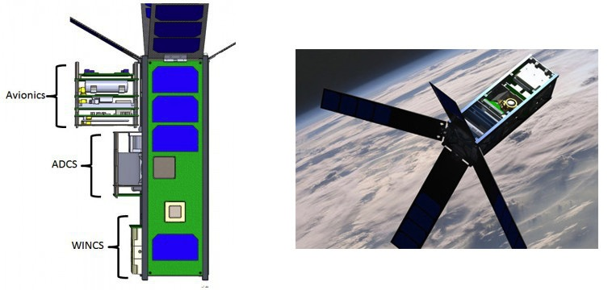
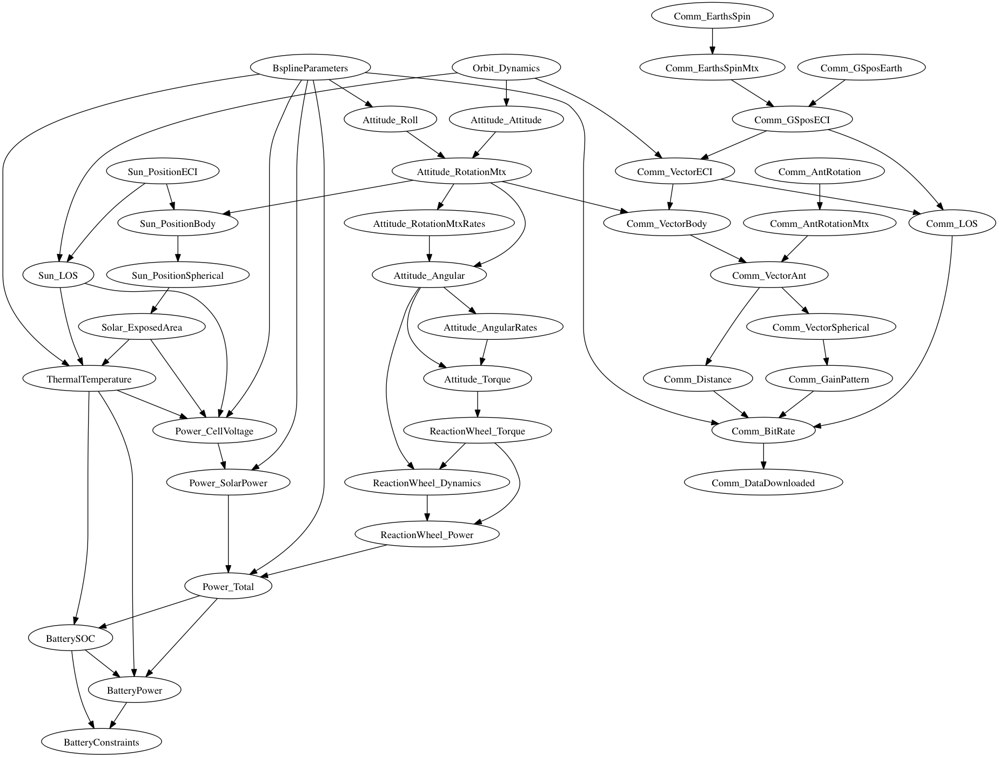

============================================================
Overview of CADRE
============================================================

`CADRE <http://exploration.engin.umich.edu/blog/?page_id=961>`_ (Cubesat investigating Atmospheric Density Response to Extreme driving)
is a mission funded by the National Science Foundation to study the
response of the :term:`thermosphere` to auroral energy inputs.

A graph-free gradient-based approach at multidisciplinary optimization of the CADRE system and mission has
previously been used successfully by `Hwang et al
<http://mdolab.engin.umich.edu/content/large-scale-mdo-small-satellite-using-novel-framework-solution-coupled-systems-and-their>`_.
We have implemented the same problem formulation using OpenMDAO. The CADRE problem represents a class of problems
with medium complexity and medium fidelity and is remarkably scalable.

The CADRE problem models the interaction of several disciplines (attitude control, communications, power and energy
storage system, thermal dynamics, craft orbital dynamics, and sun-earth position) over the course of the mission.
Specifically, the system is modeled over the course of six separate half-days of operation, computed at conditions
1, 3, 5, 7, 9, and 11 months after launch. This way, design parameters can be optimized to balance performance under
diverse conditions (such as relative location of the sun, etc.) over the course of the mission. The objective of the
optimization is to maximize the total amount of data transmitted to the ground station (Ann Arbor, MI) over the six
design points.

This figure shows the interaction among the separate components of the CADRE optimization MDPproblem:

Seven types of design parameters are involved. Four of these design parameters vary over time: current of each solar
cell ('Isetpt'); the craft roll angle ('Gamma'); communications system power ('P_comm'); and battery initial state of
charge ('iSOC').

The remaining three design variables are static: the choice of whether solar panel or radiator is installed in a
particular location on the craft ('Cellinstd'); the angle of the four fins ('finAngle'); and the angle of the
communications antenna ('antAngle').

The CADRE model is parameterized by the number of discrete time steps desired ('n') as well as a number of B-spline
control points ('m') used to interpolate the design variables to arrays of size 'n' (in the array dimension
representing time). So 'm' has direct influence on the number of the time-varying design variables in the problem,
while 'n' controls the fidelity of the results.

Five constraints for the problem relate to the battery charge rate, battery discharge rate, minimum
battery capacity, maximum battery capacity, and a battery state-of-charge periodicity constraint.

Very thorough descriptions of the engineering modeled by each discipline in the CADRE model (as well as the Multiple Design
Points [MDP] problem formulation) is given by `Hwang et al
<http://mdolab.engin.umich.edu/content/large-scale-mdo-small-satellite-using-novel-framework-solution-coupled-systems-and-their>`_
in their original paper.

The default values for 'n' and 'm' are 1500 and 300 respectively, which gives a full design problem with **over
25,000 design variables**. The graph structure of OpenMDAO's derivatives system together with high-performance
optimizers enable problems of this size to be solved efficiently.

============================================================
Structure of the CADRE Plugin
============================================================

The CADRE plugin has the following structure:

**CADRE()**: the OpenMDAO assembly containing all components that model the discipline for the CADRE satellite.
Note that this assembly does not have an optimization driver by default, only a run-once driver.

Example usage:

.. code-block:: python

    from CADRE import CADRE
    assembly = CADRE(1500, 300) # set with n and m values
    assembly.run() # Evaluates the model at it's current values

**CADRE_Optimization()**: the OpenMDAO assembly that specifies the six-point MDP CADRE optimization problem.
Specifically, it contains six instances of the CADRE assembly, which are each set to model conditions at a fixed
amount of time following launch. The default driver is SNOPT (via OpenMDAO's ``pyopt_driver``).

Example usage:

.. code-block:: python

    from CADRE import CADRE_Optimization
    top = CADRE_Optimization(n=1500, m=300) # Set with n and m values
    top.run() # Optimizes the full CADRE model across all 6 design points

Within this assembly, the CADRE design point sub-assemblies are named `pt0`, `pt1`, `pt2`, `pt3`, `pt4`, and
`pt5`. For example, to print (or assign) the initial state of charge (`iSOC`) at the first design point, you
would write:

.. code-block:: python

    print top.pt0.iSOC

A more thorough example of running this assembly is given in the full problem tutorial.

In addition to these two assemblies, all of the individual components of the CADRE model can be imported and used
directly as well.

.. code-block:: python

    from CADRE import Attitude_Roll, Solar_ExposedArea
    A = Attitude_Roll(1500) # Must initialize with an n value
    S = Solar_ExposedArea(1500, raw1=None, raw2=None)

As seen above, components which depend on raw data files (such as the ``Solar_ExposedArea`` component) can have
the raw data passed directly as optional keyword arguments. If no value is set (or if the set value is None),
then these components will default to loading the data from disc. All of the raw data files needed for the CADRE
components are installed together with the plugin.

The next two sections demonstrate how to import and use components of the full CADRE model to solve two smaller
design problems.
