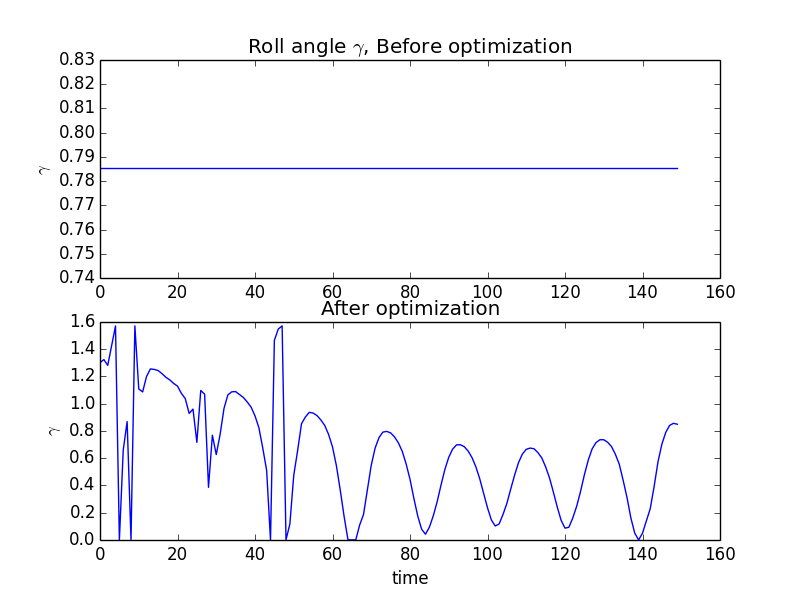

============================================================
Example: Optimization of the CADRE Roll Angle
============================================================

In this example, we will optimize the roll angle of the CADRE satellite as it passes over the ground
station to maximize the gain of the communications system. This will demonstrate how to import the
full CADRE assembly to solve a closely related (but smaller) optimization problem. This
illustrates the flexibility of OpenMDAO's problem graph and derivatives system with respect to
variations in problem formulation.

The communication system gain is computed as the output of the ``Comm_GainPattern()`` component, as
is an intermediate result in the full CADRE problem. For the sake of simplicity of the example, the
roll angle will be the only design variable considered.

The internal graph representation of this problem in OpenMDAO allows an optimization driver to
recognize that most of the components involved will never vary with respect to the roll angle. As a
result, these components will only run a single time, allowing for efficient optimization of this
smaller-scale design problem.

To begin, in a new Python file, we first import the libraries that we will use, which include (among
other things) the CADRE assembly, the standard OpenMDAO Component and Assembly classes, and the
SLSQP optimization driver.

.. code-block:: python

    from openmdao.main.api import Component
    from openmdao.main.datatypes.api import Float, Array
    from CADRE import CADRE
    from openmdao.lib.drivers.api import SLSQPdriver
    import os
    import pylab
    import numpy as np

Now, we define an OpenMDAO component that computes the sum of an input array. We will use the output of this component as our objective function
later on.

.. code-block:: python

    class NetGain(Component):

        """
        Computes the sum of an inputted gain array
        """
        net = Float(iotype="out")

        def __init__(self, n):
            super(NetGain, self).__init__()
            self.n = n
            self.add('gain', Array(np.zeros(n), iotype='in', shape=(n,)))

        def execute(self):
            self.net = sum(self.gain)

        def apply_derivT(self, arg, result):
            if 'gain' in result and 'net' in arg:
                result['gain'] += arg['net'] * np.ones(self.n)

Next, we create an instance of the CADRE base assembly and set appropriate
configuration data (starting position and velocity of the satellite, and number of days since
launch).

.. code-block:: python

    n, m = 1500, 150
    top = CADRE(n, m)

    # orbit initial position and velocity
    r_e2b_I0 = [-4969.91222,  4624.84149,
                1135.9414,  0.1874654, -1.62801666,  7.4302362]

    # number of days since launch
    LD = 5417.5

    top.set("LD", LD)
    top.set("r_e2b_I0", r_e2b_I0)

Running the assembly "as is" gives us a baseline state of the model, with all design variables at
their default values. Our objective is to maximize the total communication gain (as computed by the
``Comm_GainPattern()`` component in the CADRE assembly), so let's get that value:

.. code-block:: python

    # Run model to get baseline net gain value
    top.run()
    obj1 = sum(top.Comm_GainPattern.gain)
    print "Net comm gain before optimization:", obj1

Now we're ready to optimize. Replace the default ``RunOnce`` driver with the ``SLSQPdriver()``
optimization driver, add in the ``NetGain`` component, and configure the optimization problem:

.. code-block:: python

    # Add in optimization driver
    top.add("driver", SLSQPdriver())

    top.add("NetGain", NetGain(n))
    top.driver.workflow.add("NetGain")

    top.connect("Comm_GainPattern.gain", "NetGain.gain")

    top.driver.add_parameter("CP_gamma", low=0, high=np.pi / 2.)
    top.driver.add_objective("-NetGain.net")

Make a new two-plot figure, and in the first plot, graph the roll angles over time (the default
value being a single uniform value over time):

.. code-block:: python

    pylab.figure()
    pylab.title("Roll angle $\gamma$, Before optimization")
    pylab.subplot(211)
    pylab.plot(top.CP_gamma)

Run the assembly to perform the optimization and then record the new value of the gain:

.. code-block:: python

    top.run()
    obj2 = sum(top.Comm_GainPattern.gain)
    print "Net comm gain before optimization:", obj1
    print "Net comm gain after optimization:", obj2

Net comm gain before optimization: 900.205301576

Net comm gain after optimization: 1115.10921256

Now plot the roll angle again (but in the second subplot of the original figure) to visualize the
change in the roll angle, which is determined by the optimizer:

.. code-block:: python

    pylab.title("After")
    pylab.subplot(212)
    pylab.plot(top.CP_gamma)

    pylab.show()

This gives us the figure:

This example is implemented in ``example_roll.py``, in the top-level directory of the CADRE plugin repository, and can be run directly.
